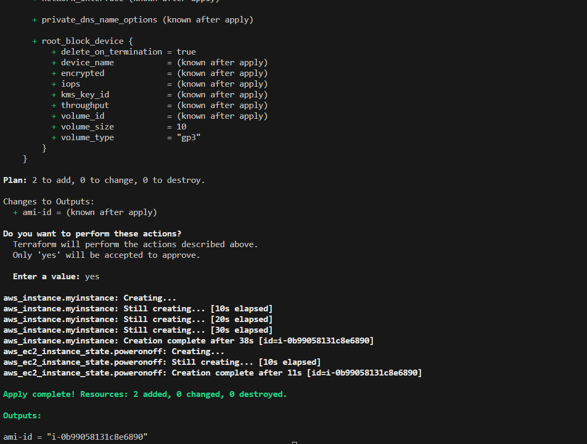
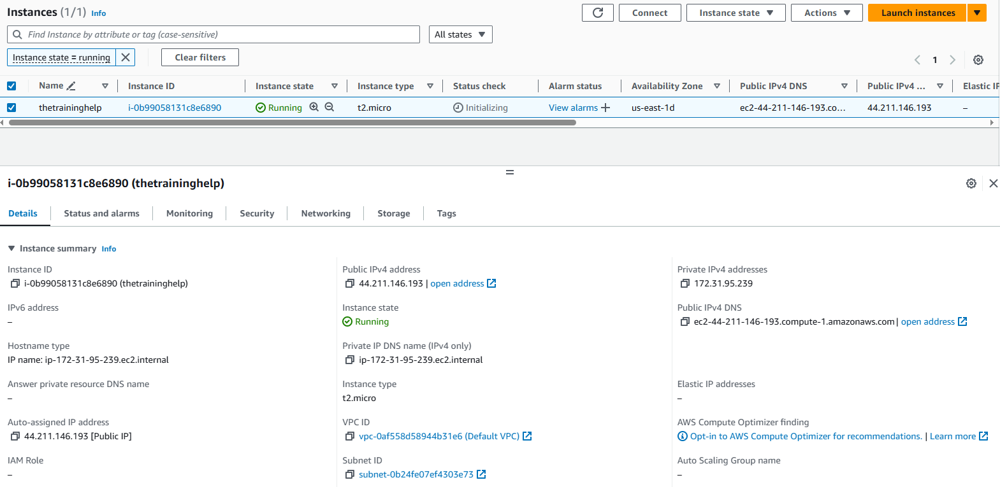
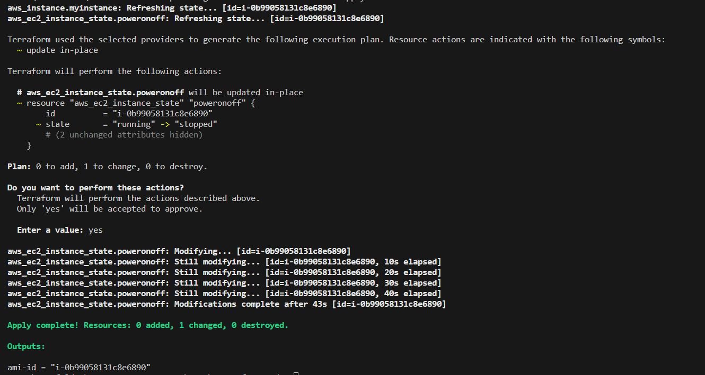
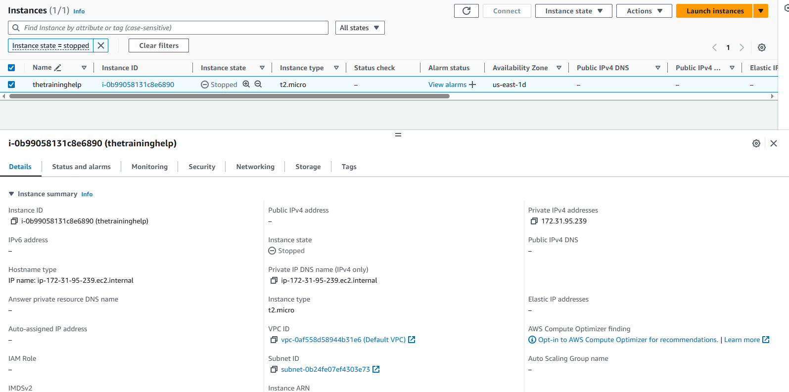
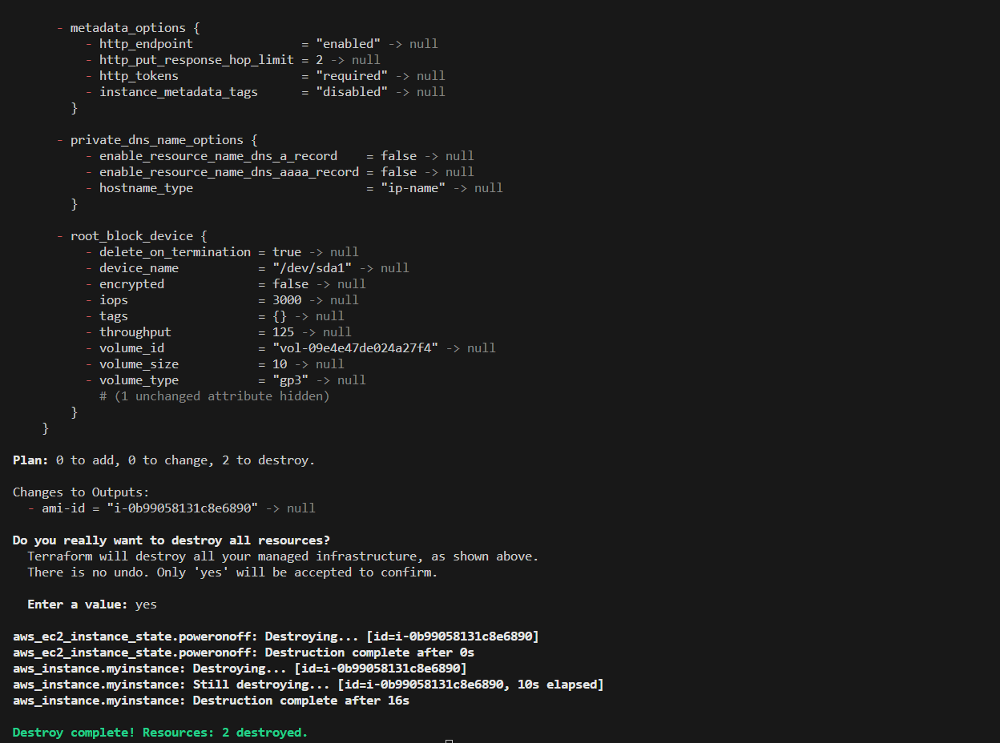

# aws-ec2-start-stop-through-terraform-code

- AWS-EC2-Power-on-off-through-terraform-code

##


<details><summary># Terraform will perform the following actions:</summary>
<p>

```BASH
Terraform will perform the following actions
```
- aws_ec2_instance_state.poweronoff will be created
- aws_instance.myinstance will be created 
</p>

</details>


# Plan: 2 to add, 0 to change, 0 to destroy.
```
terraform init
terraform validate
terraform plan
terraform apply -auto-approve
```
##


##


```
terraform apply -auto-approve
```
- aws_ec2_instance_state.poweronoff will be updated in-place
# Plan: 0 to add, 1 to change, 0 to destroy.



##


```
terraform destroy -auto-approve
```
##


##
🙂 If you find this code useful please give it a 🌟 and check back for updates! 

